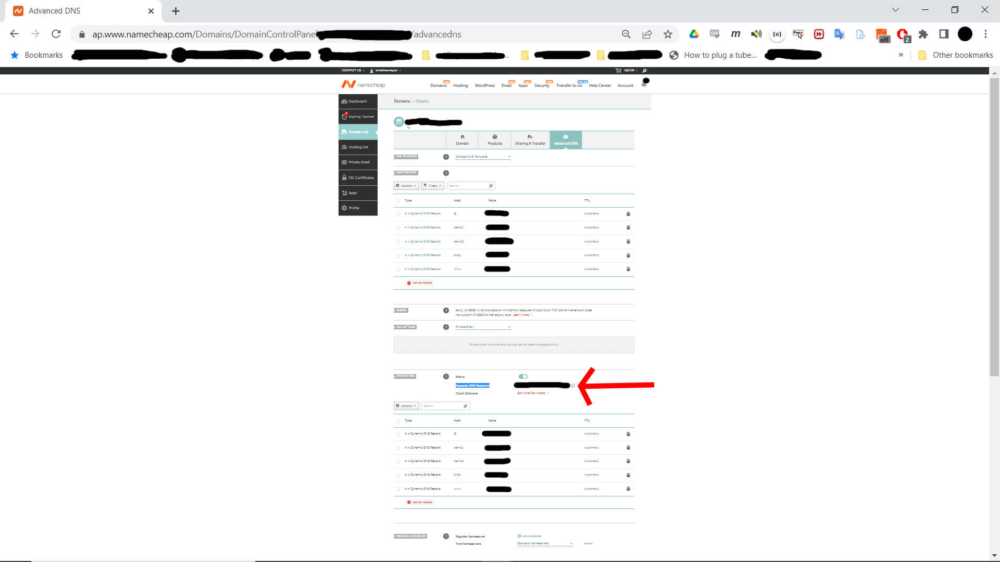

# Namecheap DNS updater

Python script to detect when when your server ip changes and automate updating namecheap A records.

this project satisfied an itch I had while running various domains on AWS and servers operating at home. While AWS provides services that can do this better, the ability to avoid a paid service and demonstrate a mix of system admin and coding skills seemed a good reason for a mini project.

### Setup

1. requires python3 and packages as per requirements
2. uses python virtual Environment to isolate from other projects.
3. requires namecheap dns configuration to set A records to ip.
   3a. see namecheap instructions <a href="https://www.namecheap.com/support/knowledgebase/article.aspx/319/2237/how-can-i-set-up-an-a-address-record-for-my-domain/" target="_blank" rel="noopener">how to set up an A (address) record for my domain</a>

   3b. refer this screenshot of namecheap configuration 
3. read the instructions on <a href="https://www.namecheap.com/support/knowledgebase/article.aspx/29/11/how-to-dynamically-update-the-hosts-ip-with-an-http-request/" target="_blank" rel="noopener">namecheap</a> to understand the code and configuration required.
4. create csv file containing a row for each combination of subdomain domain prefix &  domain. <br>
NB: the password required is the 'Dynamic DNS Password' is same for each domain, row required for each subdomain. see the screenshot above to find the 'Dynamic DNS Password' within the namecheap 'Advanced DNS' configuration page.

### Build

1. python3 -m venv namecheap_script_ip_update_env
2. source namecheap_script_ip_update_env/bin/activate
3. pip install -r requirements.txt

### Run

1. cd <installed diretory>
2. source namecheap_script_ip_update_env/bin/activate
3. Run code
```
python3 update_namecheap_ip.py
```
4. use the troubleshooting/text options within the script (see comments in code).
5. configure as a service to run on your *nix machine. edit 'update_namecheap_ip.service'
<a href="https://medium.com/codex/setup-a-python-script-as-a-service-through-systemctl-systemd-f0cc55a42267" target="_blank" rel="noopener">follow these excellent instructions</a>.<br>
NB : don't forget to enable the service to start during boot and test thoroughly.


## How to Contribute

raise an issue in the git issues tab with detailed description of issue.
add comments to existing issues.
create pull requests.

#### How to run tests
See comments in code.

## Support & Feedback

<a href="https://buymeacoffee.com/J6AYa7D" target="_blank" rel="noopener">Buy me a coffee</a>

## future upgrades

add error trapping.
improve error logging.
automated alerts to domain owners / admin if/when namecheap cannot be updated.
add tracking/testing for domain pageloads & alerts.
audit this project against existing services
